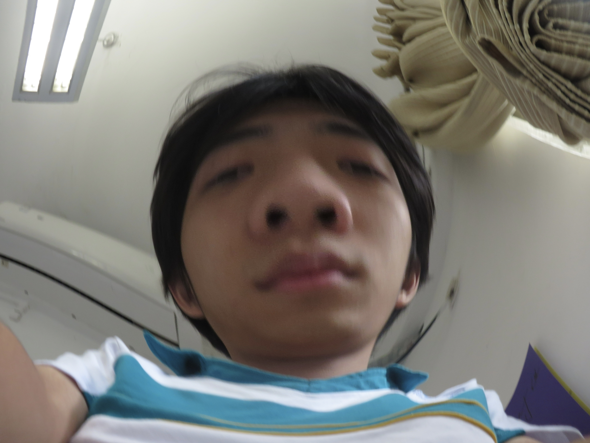

# William-Wang
#my first try
<!DOCTYPE html>
<html lang="zh">
<head>
    <meta charset="UTF-8">
    <meta name="viewport" content="width=device-width, initial-scale=1.0">
    <title>William's Cyberpunk World</title>
    
</head>
<body>
    

        
        <h1 class="neon-text">William's Cyberpunk World</h1>
        
im William，夢想環遊世界。

        
「我想要一辆GTR R35」

        

            
📱 WeChat: 66666666

        

    

</body>
</html>
